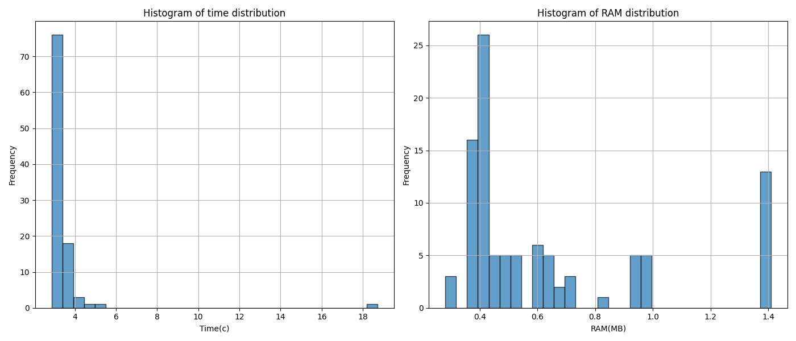
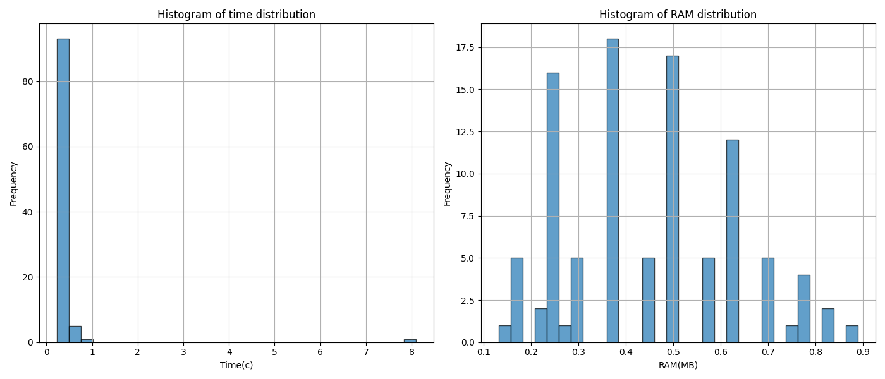
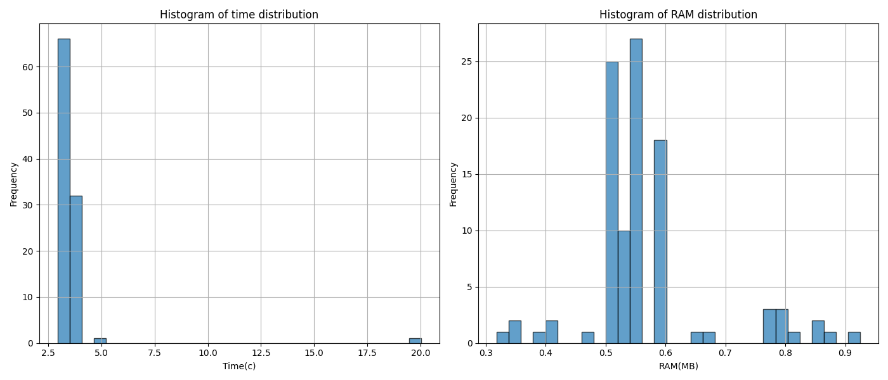
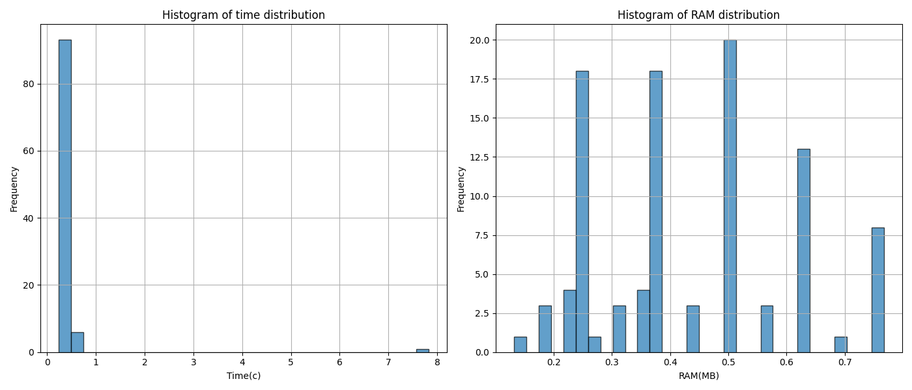

# Spark-hadoop lab

### Project structure

    .
    ├── results                 # Graphics with results
    │   ├── not_optim_1.png     # Result of experiment without spark optimizations with 1 datanode
    │   ├── not_optim_3.png     # Result of experiment without spark optimizations with 3 datanodes
    │   ├── optim_1.png         # Result of experiment with spark optimizations and 1 datanodes
    │   └── optim_3.png         # Result of experiment with spark optimizations and 3 datanodes
    ├── app.py                  # Script for running Spark experiment
    ├── dataset.csv             # File with dataset
    ├── docker-compose-3.yml    # Docker Compose configuration for a setup containers with 3 datanodes
    ├── docker-compose.yml      # Docker Compose configuration for a setup containers with 1 datanode
    ├── dockerfile              # Dockerfile with setting up spark-worker-1
    ├── hadoop.env              # Hadoop env settings
    ├── README.md               # Readme file
    └── utils.py                # Script with helping functionality for Spark experiments

## How to run:
1. Loading dataset to hdfs:
```
docker cp dataset.csv namenode:/tmp/dataset.csv
docker exec -it namenode bash -c "hdfs dfs -put /tmp/dataset.csv /polina/dataset/"
```
 
2. Load app file to spark-worker container:
```
docker exec -ti spark-worker-1 bash -c "mkdir -p /opt/spark-apps"

docker cp /home/hadoop/hadoop_lab/app.py spark-worker-1:/opt/spark-apps/app.py
docker cp /home/hadoop/hadoop_lab/utils.py spark-worker-1:/opt/spark-apps/utils.py
```

3. Run app:
```
docker exec -it spark-worker-1 /spark/bin/spark-submit /opt/spark-apps/app.py --spark-url spark://spark-master:7077
```

# Results





